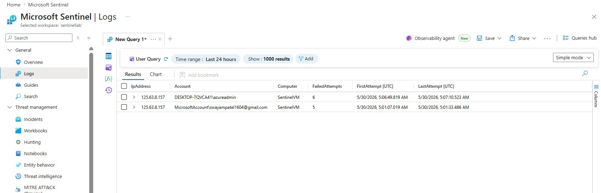
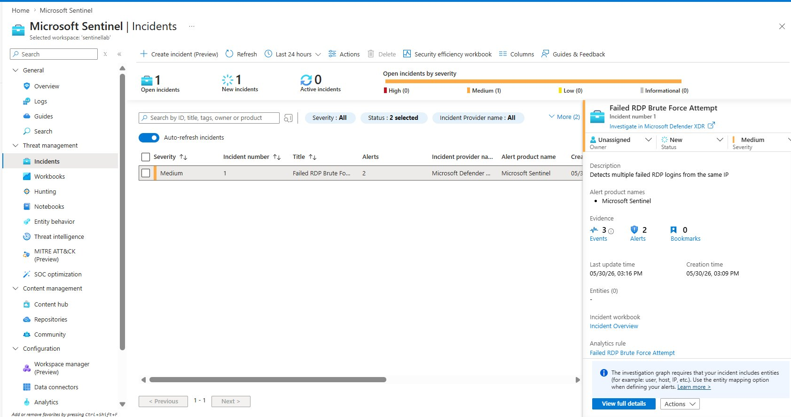
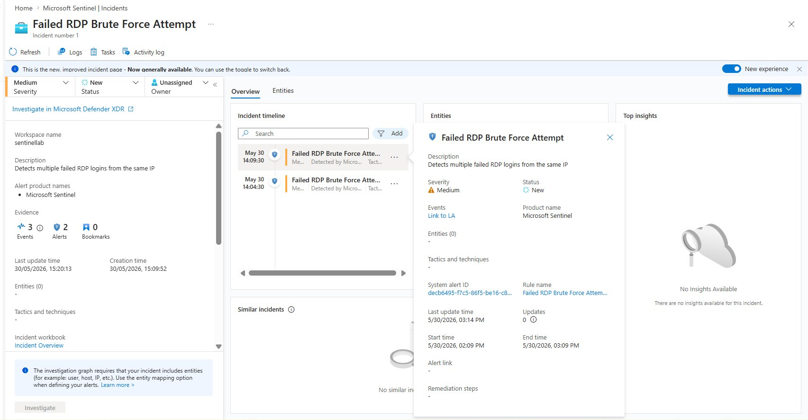
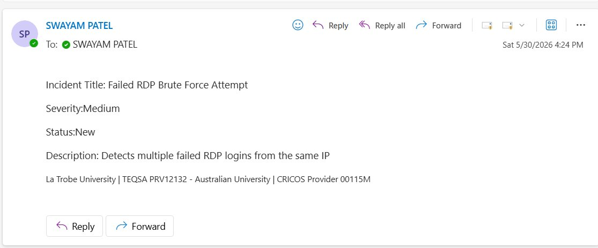

# 🛡️ Azure Sentinel Lab — Cloud SIEM Home Lab


> A fully functional cloud-native SIEM lab built on Microsoft Azure, simulating real-world SOC workflows — from threat detection to automated incident response.

---

## 📋 Table of Contents
- [Overview](#overview)
- [Architecture](#architecture)
- [Phases](#phases)
- [KQL Detection Rules](#kql-detection-rules)
- [Results](#results)
- [Screenshots](#screenshots)
- [Skills Demonstrated](#skills-demonstrated)

---

## Overview

This project demonstrates end-to-end Security Information and Event Management (SIEM) capabilities using Microsoft Sentinel on Azure. The lab simulates a real SOC environment by:

- Deploying a Windows Server VM as an attack target
- Collecting security event logs via Azure Monitor Agent
- Writing custom KQL detection rules for brute force attacks
- Automatically triggering incidents and sending email alerts via Logic Apps

**Duration:** 1 day  
**Cost:** Free Azure trial credits (~A$15 used)  
**Environment:** Microsoft Azure (Australia East)

---

## Architecture

```
┌─────────────────────────────────────────────────────────────┐
│                    Azure Subscription                        │
│                                                             │
│  ┌──────────────┐    ┌─────────────────────────────────┐   │
│  │  SentinelVM  │───▶│   Log Analytics Workspace       │   │
│  │  (Win Server │    │   (sentinellab)                 │   │
│  │   2022)      │    └──────────────┬──────────────────┘   │
│  └──────────────┘                   │                       │
│         │                           ▼                       │
│         │                  ┌─────────────────┐             │
│         │                  │ Microsoft        │             │
│  RDP    │                  │ Sentinel         │             │
│  Attacks│                  │ (SIEM)           │             │
│         │                  └────────┬────────┘             │
│         │                           │                       │
│         │                  ┌────────▼────────┐             │
│         └─────────────────▶│ KQL Analytics   │             │
│                             │ Rules           │             │
│                             └────────┬────────┘             │
│                                      │                       │
│                             ┌────────▼────────┐             │
│                             │ Logic App        │             │
│                             │ Playbook         │             │
│                             └────────┬────────┘             │
│                                      │                       │
│                             ┌────────▼────────┐             │
│                             │ Email Alert      │             │
│                             │ (SOC Analyst)    │             │
└─────────────────────────────────────────────────────────────┘
```

---

## Phases

### ✅ Phase 1 — Azure Environment Setup
- Created free Azure account with $200 credits
- Deployed Resource Group: `RG-SentinelLab`
- Created Log Analytics Workspace: `sentinellab` (Australia East)

### ✅ Phase 2 — Microsoft Sentinel Deployment
- Added Microsoft Sentinel to `sentinellab` workspace
- Configured data connectors:
  - **Azure Activity** — subscription-level event logging via Azure Policy
  - **Microsoft Entra ID** — audit logs and sign-in logs
  - **Windows Security Events via AMA** — VM security event collection

### ✅ Phase 3 — Windows VM Deployment
- Deployed `SentinelVM` (Windows Server 2022 Datacenter, B2ats_v2)
- Configured Azure Monitor Agent via Data Collection Rule (DCR)
- Enabled RDP (port 3389) for attack simulation
- Configured auto-shutdown to preserve credits

### ✅ Phase 4 — KQL Detection Rules
Created 2 custom analytics rules:
1. **Failed RDP Brute Force Attempt** (Medium severity)
2. **Successful Login After Multiple Failures** (High severity)

### ✅ Phase 5 — Attack Simulation & Alert Triggering
- Simulated RDP brute force attack from local machine
- Generated EventID 4625 (failed logon) and EventID 4624 (successful logon)
- Sentinel detected attacks and created Incident #1 within 5 minutes
- Incident timeline showed 8 alerts across 15 events

### ✅ Phase 6 — Logic Apps Playbook Automation
- Created `Notify-SOC-On-Incident` Logic App playbook
- Connected to Outlook via automation rule trigger
- Automated email alerts sent to SOC analyst on every new incident
- Verified end-to-end automation with 7 successful playbook runs

---

## KQL Detection Rules

### Rule 1 — Failed RDP Brute Force Attempt
```kql
SecurityEvent
| where EventID == 4625
| where LogonType == 3
| summarize FailedAttempts = count(), 
            FirstAttempt = min(TimeGenerated), 
            LastAttempt = max(TimeGenerated) 
            by IpAddress, Account, Computer
| where FailedAttempts >= 5
| order by FailedAttempts desc
```
**Trigger:** 5+ failed network logon attempts from the same IP  
**Severity:** Medium  
**Schedule:** Every 5 minutes, 1-hour lookback

---

### Rule 2 — Successful Login After Multiple Failures
```kql
let FailedLogins = SecurityEvent
| where EventID == 4625
| where TimeGenerated > ago(1h)
| summarize FailedCount = count() by IpAddress, Account
| where FailedCount >= 5;
SecurityEvent
| where EventID == 4624
| where LogonType == 3
| join kind=inner FailedLogins on Account
| project TimeGenerated, Account, IpAddress, Computer, FailedCount
| order by TimeGenerated desc
```
**Trigger:** Successful login following 5+ failed attempts (possible brute force success)  
**Severity:** High  
**Schedule:** Every 5 minutes, 1-hour lookback

---

## Results

| Metric | Value |
|--------|-------|
| Data Connectors Configured | 3 |
| Custom KQL Rules Created | 2 |
| Real Incidents Generated | 1 |
| Alerts Fired | 8 |
| Events Captured | 15 |
| Playbook Runs | 7 (all succeeded) |
| Automated Emails Sent | ✅ |
| Time to First Incident | ~5 minutes |

---

## Screenshots

### KQL Query — Real Attack Logs Detected


---

### Incidents Dashboard — Alert Fired


---

### Incident Investigation — Full Timeline


---

### Automated SOC Email Alert


---

## Skills Demonstrated

| Category | Skills |
|----------|--------|
| **Cloud** | Microsoft Azure, Resource Groups, Azure Policy, Azure Monitor |
| **SIEM** | Microsoft Sentinel, Log Analytics, Data Connectors, Analytics Rules |
| **Detection Engineering** | KQL (Kusto Query Language), Custom Detection Rules, Event ID Analysis |
| **Incident Response** | Incident Triage, Alert Investigation, SOC Workflows |
| **Automation** | Logic Apps, Playbook Development, Automated Response |
| **Networking** | NSG Rules, RDP, Virtual Networks |
| **Windows Security** | Event Log Analysis, EventID 4624/4625, Logon Types |

---

## 🔗 Connect

**Author:** Swayam Patel  
**LinkedIn:** [swayam-patel-43503a344](https://linkedin.com/in/swayam-patel-43503a344)  
**GitHub:** [S4mmy1604](https://github.com/S4mmy1604)  
**Email:** Swayampatel1604@gmail.com

---

> *Built as part of a cybersecurity home lab portfolio while studying Bachelor of Cybersecurity at La Trobe University.*
